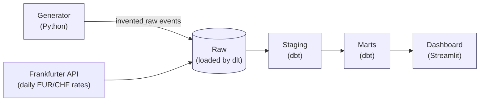
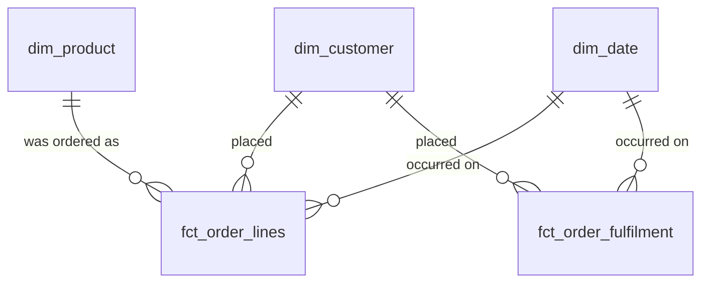

# Nordmarkt Warehouse

An analytics warehouse for a fictional Berlin online marketplace, built with dbt on DuckDB.

This repo is a portfolio project. It exists to show that I can take raw, messy operational data and turn it into a small set of clean, well-documented tables that a business person can actually query and trust.

---

## Why this exists

Nordmarkt sells homeware across Germany, Austria and Switzerland. Customers place orders, orders get shipped, cancelled, or refunded, customers move house, change their subscription tier, and occasionally pay in Swiss francs instead of euros. The raw data is a mess, as raw data always is: events arrive late, the same order sometimes appears twice, timestamps are recorded in three different timezones, and a column got renamed partway through the history with no note left behind.

This repo sits between that mess and questions like:

- How much did we sell last month, in euros, excluding refunds?
- How many customers are actually active right now?
- Which product categories are growing, and how fast?
- How long does it take to go from order placed to parcel delivered?

I work as a data engineer and I'm moving into analytics engineering. The two jobs overlap but are judged differently: data engineering is judged on whether the pipeline runs, analytics engineering on whether the numbers are right and people trust them. So this project puts the weight on the second thing — deciding what each table means before writing it, writing down why each decision was made, testing business rules rather than just checking for nulls, documenting things a non-engineer could read. The code being clean is table stakes; the judgement is the deliverable.

---

## The value it creates

Strip away the fictional company and the value is the same as any real analytics-engineering project:

- **One number, not five.** Before this exists, "revenue" means something slightly different in every spreadsheet someone built alone. After it exists, `fct_order_lines.net_revenue_eur` is *the* answer, and anyone can check how it's defined.
- **Trust that survives a follow-up question.** A dashboard nobody can explain gets ignored the first time a number looks off. Every mart column has a real description, every business rule has a test, and every non-obvious call is written down in `DECISIONS.md` — so "why does this say X" always has an answer.
- **History that doesn't get silently erased.** `dim_customer` as a Type 2 dimension means a customer moving to a new city doesn't retroactively rewrite where their past orders were shipped. That's the difference between a report you can defend and one you can't.
- **Late data doesn't mean wrong data.** The incremental models pick up shipments and refunds that arrive after the fact, instead of silently under-counting until the next full rebuild.
- **A stranger can pick it up.** Someone joining the project — or evaluating it — can clone it, run `make demo`, and understand every table without asking the person who built it. That's the actual test of whether documentation worked.

---

## How it fits together

Data flows through four stages. Each stage has one job.



**Generator** — A Python script that invents Nordmarkt's history: customers, orders, shipments, refunds. It deliberately introduces realistic problems (duplicates, late-arriving events, a mid-history schema change) so the rest of the project has something real to defend against.

**Raw** — The generated data lands in the warehouse untouched. Nothing is cleaned here. If the source is ugly, the raw layer is ugly, and that's correct. Loaded with `dlt`, which also pulls real daily exchange rates from a public API so the currency conversion isn't fake.

**Staging** — One model per source table. Renames columns to a consistent convention, casts types, converts every timestamp to UTC, removes duplicates. No business logic and no joins. Boring on purpose.

**Marts** — The actual product. A small number of tables shaped so that a business question maps to a single, obvious query. This is where the thinking lives.

**Dashboard** — A three-page Streamlit app proving the marts answer the questions they claim to answer.

Why each of these tools and not the obvious alternatives: see [STACK.md](docs/STACK.md).
How it all gets published so people can actually look at it: see [DEPLOY.md](docs/DEPLOY.md).

---

## What's in the warehouse

The marts follow a **star schema**: a few large "fact" tables recording things that happened, surrounded by smaller "dimension" tables describing the people and things involved.

| Table | What it holds | Question it answers |
|---|---|---|
| `fct_order_lines` | One row per product per order | How much did we sell, of what, to whom |
| `fct_order_fulfilment` | One row per order, tracking its whole lifecycle | Where do orders get stuck, and for how long |
| `dim_customer` | One row per customer per version of their details | Who bought this, and where did they live *at the time* |
| `dim_product` | One row per product | What category, what price band, which supplier |
| `dim_date` | One row per calendar day | Weekday vs weekend, German public holidays, fiscal periods |



Two of these deserve a note.

**`fct_order_lines` is at order-line grain, not order grain.** That means one row per product within an order, so a three-item order produces three rows. This is a deliberate choice: it lets you analyse by product category without unpicking a nested field. The cost is that you have to be careful summing order-level values like shipping, which would otherwise be triple-counted. The model handles this by allocating shipping proportionally across lines, and the tests enforce that the allocated amounts add back up to the original.

**`dim_customer` tracks history.** If a customer moves from Berlin to Munich, most systems would just overwrite the address, and suddenly all their past orders look like they were shipped to Munich. This table keeps both versions with valid-from and valid-to dates, so a report on "sales by city in March" reflects where people actually lived in March. In dimensional modelling this is called a Type 2 slowly changing dimension. It's more work and it's almost always the right call.

---

## What the numbers mean

Every column has a real description in `models/marts/_marts.yml` — this is the short version of the ones people actually ask about.

**"Revenue" means `fct_order_lines.net_revenue_eur`**: quantity × unit price, minus this line's share of the order's discount. Shipping is deliberately excluded — it's cost recovery, not product revenue, though it's still available (`allocated_shipping_eur`) for anything that needs total order economics.

**Everything is in EUR, converted using the rate on the order's date, not today's.** Shipping and discount are the only amounts actually captured in a non-EUR currency (CHF, for Swiss customers) — the product catalog is EUR-denominated throughout. That conversion happens once per order, using the EUR→CHF rate `stg_fx_rates` pulled from the Frankfurter API for that specific date, before shipping/discount get allocated across the order's lines.

**`fct_order_fulfilment` tracks placed → shipped → delivered → refunded** — not the picked stage sometimes used as an example, because the generator never produces a picked event. Duration columns (`hours_placed_to_shipped` etc.) are null until an order reaches that stage.

**Both fact tables are incremental**, reprocessing a trailing window of recent activity on every run rather than a full rebuild, so that upstream rows arriving late (which the generator deliberately creates for shipments and refunds) still get picked up. See `DECISIONS.md` for why, and `macros/backfill_incremental_model.sql` for forcing a full historical reprocess of an older window.

---

## Running it

```bash
uv sync
uv run python generator/generate.py --years 3
uv run python pipeline/load.py
uv run dbt build --target duckdb
uv run dbt docs generate && uv run dbt docs serve
```

Or, equivalently: `make demo`. For the dashboard: `make dashboard` (builds the warehouse itself on first load if `make demo` hasn't already run).

---

## Glossary

Terms that show up in the code, in plain words.

**Grain** — What one row of a table represents. Getting this wrong is the single most common cause of wrong numbers, which is why every fact model states it in the first comment.

**Fact table** — Records things that happened. Orders, shipments, refunds. Long and narrow, grows forever.

**Dimension table** — Describes the things involved. Customers, products, dates. Short and wide, changes slowly.

**Star schema** — Facts in the middle, dimensions around the edge, joined on keys. Named for how it looks drawn out. The point is that most business questions become one join away from an answer.

**Slowly changing dimension (Type 2)** — Keeping history when a descriptive attribute changes, instead of overwriting it. Lets you ask "what was true back then" rather than only "what is true now".

**Accumulating snapshot** — A fact table with one row per process, updated as the process moves through its stages. Good for anything with a lifecycle, like an order working its way to a doorstep.

**Incremental model** — A table that only processes new or changed rows on each run rather than rebuilding everything. Faster and much cheaper, at the cost of having to think carefully about late-arriving data.

**Staging vs marts** — Staging is cleanup with no opinions. Marts are opinions, built on clean data. Keeping them separate means you can change your mind about the business logic without re-litigating the data cleaning.

---

## Status

`make demo` generates the data, loads it (twice, for real snapshot/lookback history), and builds the full warehouse against DuckDB — star schema, incremental facts, business-rule and distribution tests, all passing. Revenue-by-category-by-month is answerable in one `SELECT`. dbt docs and the demo site publish to GitHub Pages automatically on every push to `main`.

One thing remains blocked on an account only a person can create, not on anything left to build: the Streamlit dashboard needs to actually be deployed on Streamlit Community Cloud — see `dashboards/README.md`. Everything else, including running the dashboard locally, needs no account.
