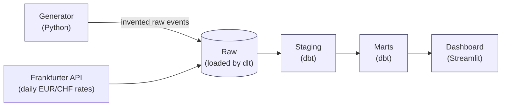
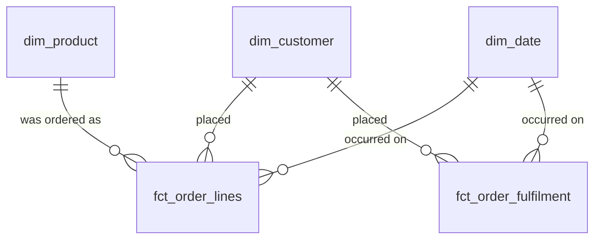

# Nordmarkt Warehouse

An analytics warehouse for a fictional Berlin online marketplace, built with dbt on DuckDB.

**Stack:** dbt Core · DuckDB · dlt · Python (Faker, Pydantic) · MotherDuck · Streamlit · GitHub Actions

## Run locally

Requires [uv](https://docs.astral.sh/uv/) and `make`.

```bash
uv sync
make demo       # generate -> load -> dbt build, twice (real dim_customer snapshot history)
make dashboard  # launch the Streamlit dashboard locally
```

`make docs` builds and serves the dbt documentation site locally. `make full` regenerates a larger dataset (~500k order lines) for exercising the incremental/backfill logic. See the `Makefile` for every target.

## Deployed

- **Dashboard:** [nordmarkt-warehouse.streamlit.app](https://nordmarkt-warehouse.streamlit.app/), on Streamlit Community Cloud, querying a MotherDuck database that `.github/workflows/motherduck.yml` keeps built and fresh (nightly, and on every push to `main`)
- **dbt docs:** [gunjanmishra94.github.io/nordmarkt-warehouse](https://gunjanmishra94.github.io/nordmarkt-warehouse/), the lineage graph and every column's description, built and published by `.github/workflows/demo.yml`

---

## Why this exists

This project takes raw, messy operational data and turns it into a small set of clean, well-documented tables that a business person can actually query and trust.

Nordmarkt sells homeware across Germany, Austria and Switzerland: orders get shipped, cancelled, or refunded, customers move house or change tier, some pay in Swiss francs. The raw data is a mess, as raw data always is: events arrive late, orders duplicate, timestamps span three timezones, and a column got renamed mid-history with no note left behind. This repo sits between that mess and questions like:

- How much did we sell last month, in euros, excluding refunds?
- How many customers are actually active right now?
- Which product categories are growing, and how fast?
- How long does it take to go from order placed to parcel delivered?

## The value it creates

- **One number, not five.** `fct_order_lines.net_revenue_eur` is *the* answer to "what's our revenue", and anyone can check how it's defined.
- **Trust that survives a follow-up question.** Every mart column has a real description, every business rule has a test, and every non-obvious call is written down in `DECISIONS.md`, so "why does this say X" always has an answer.
- **History that doesn't get silently erased.** `dim_customer` is a Type 2 dimension, so a customer moving city doesn't retroactively rewrite where their past orders shipped.
- **Late data doesn't mean wrong data.** The incremental models pick up shipments and refunds that arrive after the fact, instead of silently under-counting until the next full rebuild.

## How it fits together



- **Generator:** invents Nordmarkt's history (customers, orders, shipments, refunds), deliberately introducing realistic problems (duplicates, late-arriving events, a mid-history schema change) so the rest of the project has something real to defend against.
- **Raw:** the generated data lands untouched. Nothing is cleaned here; if the source is ugly, the raw layer is ugly. Loaded with `dlt`, which also pulls real daily exchange rates from a public API.
- **Staging:** one model per source table: renames, casts, converts every timestamp to UTC, dedupes. No business logic, no joins.
- **Marts:** the actual product. A small number of tables shaped so a business question maps to one obvious query.
- **Dashboard:** a three-page Streamlit app proving the marts answer the questions they claim to.

> **Note:** Why each tool and not the obvious alternative: [STACK.md](docs/STACK.md). How it's all published: [DEPLOY.md](docs/DEPLOY.md).

## What's in the warehouse

A **star schema**: a few fact tables recording things that happened, surrounded by dimension tables describing who and what was involved.

| Table | What it holds | Question it answers |
|---|---|---|
| `fct_order_lines` | One row per product per order | How much did we sell, of what, to whom |
| `fct_order_fulfilment` | One row per order, tracking its whole lifecycle | Where do orders get stuck, and for how long |
| `dim_customer` | One row per customer per version of their details | Who bought this, and where did they live *at the time* |
| `dim_product` | One row per product | What category, what price band, which supplier |
| `dim_date` | One row per calendar day | Weekday vs weekend, German public holidays, fiscal periods |



Two calls worth flagging. `fct_order_lines` is at **order-line grain** (one row per product within an order), not order grain, which lets you analyse by category at the cost of needing shipping/discount allocated proportionally across lines rather than naively summed (tested). `dim_customer` is a **Type 2 slowly changing dimension**: it keeps both address versions with valid-from/valid-to dates, so "sales by city in March" reflects where people actually lived in March, not where they live now.

## What the numbers mean

Every column has a real description in `models/marts/_marts.yml`; this is the short version.

- **"Revenue"** is `fct_order_lines.net_revenue_eur`: quantity × unit price, minus this line's share of the order's discount. Shipping is excluded (it's cost recovery, not product revenue), though still available as `allocated_shipping_eur`.
- **Everything is in EUR**, converted using the FX rate on the order's date, not today's.
- **`fct_order_fulfilment` tracks placed → shipped → delivered → refunded.** No "picked" stage, because the generator never produces one. Duration columns are null until an order reaches that stage.
- **Both fact tables are incremental**, reprocessing a trailing window on every run so late-arriving shipments/refunds still get picked up. See `DECISIONS.md`.
